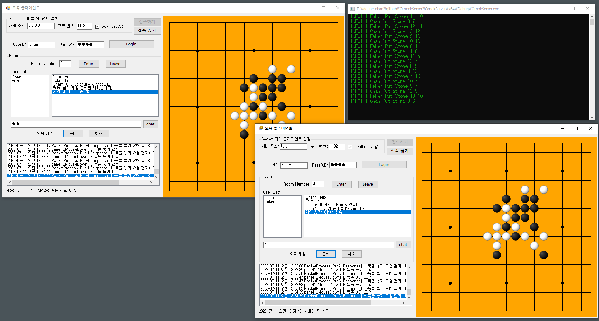
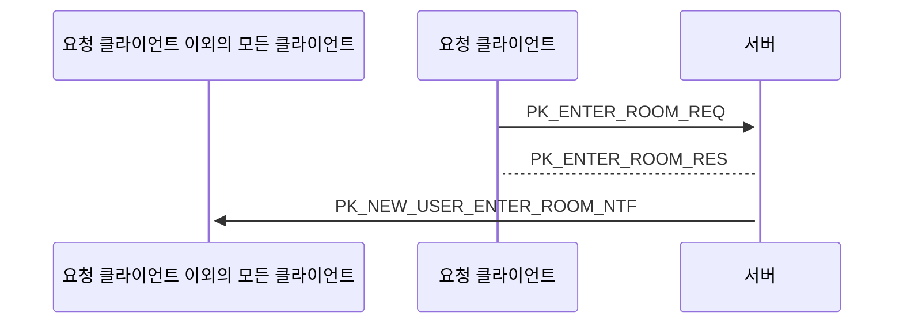
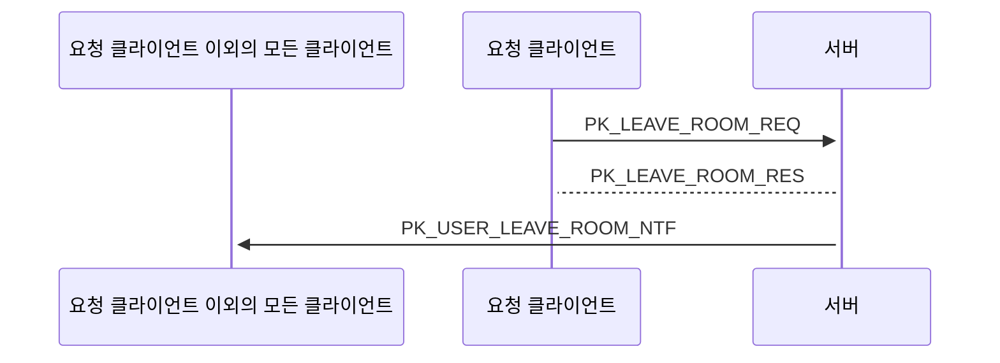
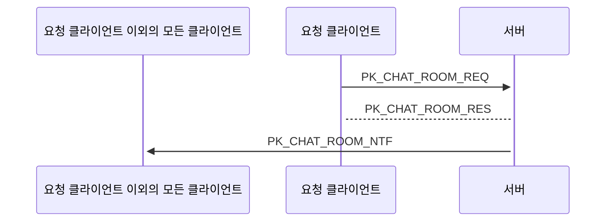
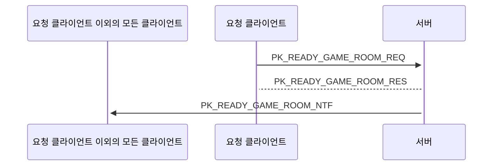
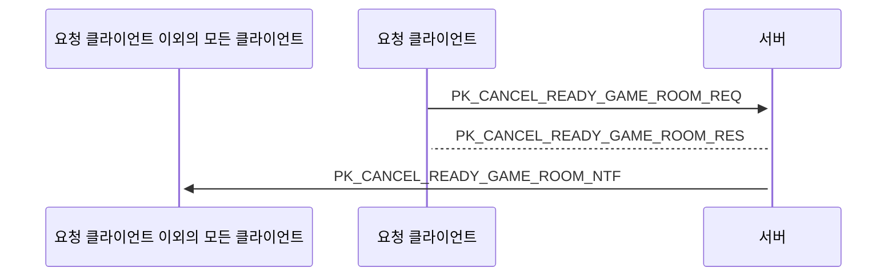
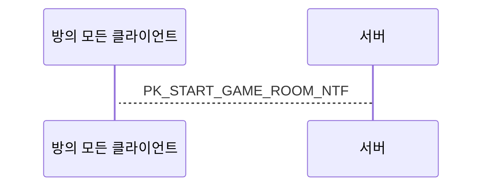
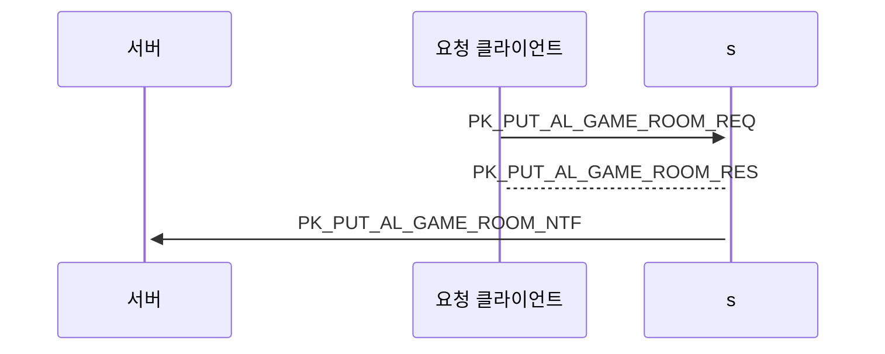
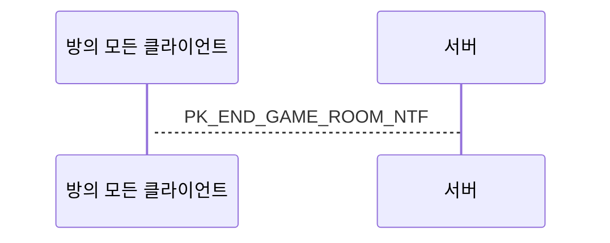
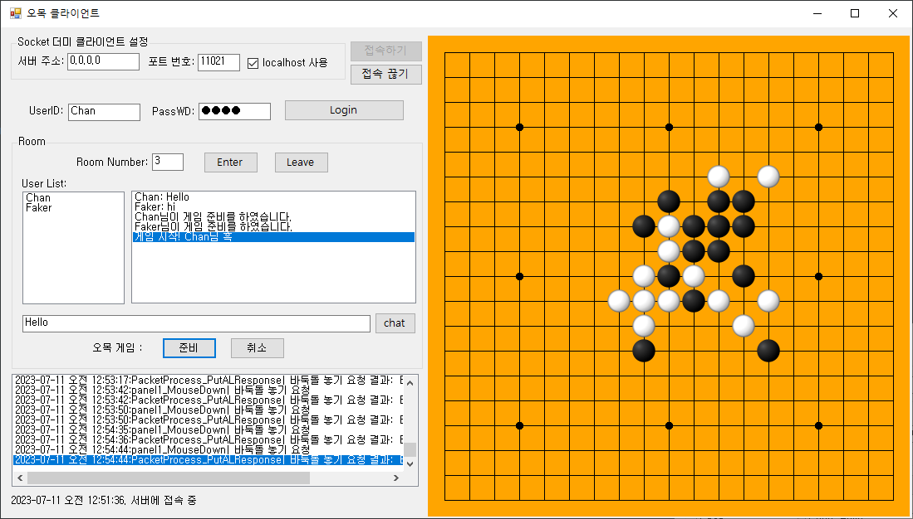

# OmokServer

C++, TCP, Socket 프로그래밍을 학습하고 이를 통해 MO 구조 방식의 게임 서버를 만들기

Mento : [jacking75](https://github.com/jacking75)

   

YouTube Link : https://www.youtube.com/watch?v=Gc7uYHf7EHE&t=1s

## 진행 과정

1. 게임 서버 틀 만들기
	- 로그인 기능 간단하게 구현
	- 네트워크 프로그래밍은 멘토가 제공하는 네트워크 라이브러리 코드를 사용
		- 네트워크 프로그래밍은 추후 학습
	- 테스트용 클라이언트를 만들어 패킷 주고 받아보기
2. 방 입장, 방 나가기, 방 채팅 구현
3. 오목 게임 컨텐츠 구현
	- 게임 시작 요청, 게임 시작
	- 오목 두기
	- 오목 체크, 게임종료

## 기능 구현

### 1) 방 입장

- 클라이언트에서 요청 시에 방번호를 보낸다
- 방번호가 0 이상이면 유저를 요청한 방에 입장시킨다
- 방번호가 -1 이면 서버에서 빈 방을 골라서 입장시킨다.
- 방에 이미 입장한 유저가 있는 경우 이미 있는 유저들에게 새로 들어온 유저의 정보를 보내준다.  
  

### 2) 방 나가기

- 클라이언트는 이 요청에는 Body 데이터가 없다(서버는 이 클라이언트가 어느 방에 들어가 있는지 알고 있으므로)
- 방에 있는 유저 수가 2 이상인 경우에 나가는 경우 아직 남아 있는 유저들에게 방을 나가가는 유저가 누구인지 알려준다
- 클라이언트가 방에 있는 상태에서 프로그램을 종료하면 네트워크 접속이 끊어지고, 서버는 접속이 끊어진 유저가 방에 있는지 조사하 후 방에 있다면 방 나가기 처리를 한다.  
  

### 3) 방 채팅

- 방에 있는 유저가 채팅 메시지를 보내면 방에 있는 모든 유저에게 브로드캐스트 한다.
   

### 4) 게임 시작 요청

- 방에 있는 유저가 게임 시작 요청을 보내면 방에 있는 모든 유저에게 브로드캐스트 한다.  
  

### 5) 게임 시작 취소

### 6) 게임 시작 통보

- 방의 게임을 할 유저가 모두 게임 시작 요청을 했다면 게임 시작을 알린다. 첫번째 턴 유저 정보도 담는다  
  

### 7) 알 두기

- 턴을 가진 유저만 요청할 수 있다. NTF 패킷에서 다음 유저의 턴 정보를 알려준다   
  

### 8) 게임 종료 체크

- 위의 알 두기 이후 오목 체크를 한 후 게임이 종료 되면 알린다   

## 오목 클라이언트

서버 개발이 메인이다보니 클라이언트는 C#.net을 사용해 Winforms으로 간단히 만들었다.

참고 링크 : https://m.post.naver.com/viewer/postView.naver?volumeNo=16508162&memberNo=11439725

   

